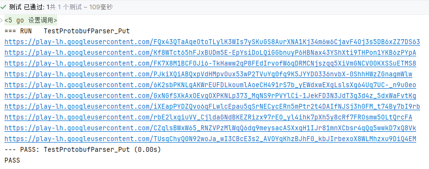

## Example

```go
package protobufparser

import (
	"fmt"
	"github.com/Humenger/protobufparser"
	"io/ioutil"
	"testing"
)

func TestPQuery(t *testing.T) {
	f, err := ioutil.ReadFile("detail")
	if err != nil {
		panic(err)
	}
	value, err := PQuery(f, 1, 2, 4, 10, 5)
	if err != nil {
		panic(err)
	}
	for _, v := range value {
		fmt.Println(string(v.([]byte)))
	}
}
```

